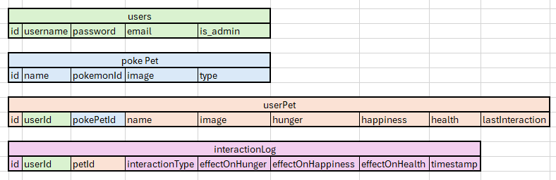

# Capstone 2: Pokegotchi Central

# Note: Branch 'newMain' contains the most recent update.
### Current Schema Design:

Note: The InteractionLog table has not been implemented yet

API data sourced from: https://pokeapi.co

# Description
Pokegotchi Central is a web application that allows users to manage their virtual pets, adopt new pets, and interact with PokePets. Users can register an account, log in, and access various features to care for their pets and explore the world of PokePets.

## Features
- User Authentication: Implementing user authentication allows users to register, log in, and access their account to manage their pets.
- Pet Management: Users can view a list of their owned pets, view detailed information about each pet, and interact with them to meet their needs.
- PokePets Adoption: Users can browse and adopt PokePets, expanding their collection of virtual pets.
- Search Functionality: Search functionality allows users to easily find specific pets or PokePets based on their names or attributes.

## Testing
To run the tests, execute the following command:
npx test

## User Flow
- Registration/Login: Users can register an account or log in with existing credentials.
- Home Page: Upon logging in, users are greeted with the home page where they can navigate to different sections of the website.
- Pet Management: Users can view their owned pets, view details about each pet, and interact with them to fulfill their needs.
- PokePets Adoption: Users can browse available PokePets and adopt new ones to add to their collection.
- Profile: Users can view and edit their profile information, including email and password.

## API Notes
The backend of Pokegotchi Central utilizes a custom API built with NodeJs and Express. The API handles user authentication, pet management, and PokePets data.

## Technology Stack
- Frontend: ReactJs
- Backend: NodeJs, Express
- Database: PostgreSQL
- Styling: Bootstrap, Reactstrap
- Testing: Jest, React Testing Library
  
## Additional Notes
Stretch goals incude:
- Nicknames for pets
- Abandon/Delete pet
- Pet 'dies' when health reaches 0
- Interactions based on timestamps (stats counting down over time instead of static stats)
